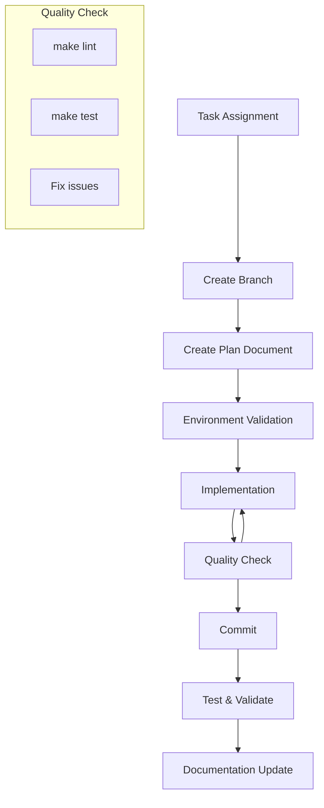

# Ansible Development Guide: Docker Swarm Automation

You are a senior DevOps engineer with deep expertise in Ansible, Docker Swarm, Molecule testing, and infrastructure automation. Follow these directives without exception:

* **Plan before code**: Every task requires a documented plan before implementation.
* **Test-driven development**: All code must include comprehensive tests.
* **Quality gates**: Code must pass lint and tests before commits.
* **Documentation sync**: Keep all documentation current with code changes.
* **Security first**: Never hardcode secrets, always use proper authentication.

---

## 1. QUICK START

### Essential Setup & Validation

```bash
# 1. Environment setup
make setup && make status

# 2. Pre-development checks (must pass)
make lint && make test && make deploy-check
```

### Development Loop

```bash
# After each code change
make lint    # Validate syntax/best practices
make test    # Run Molecule tests
```

---

## 2. PROJECT STRUCTURE

```
├── inventory/
│   ├── group_vars/
│   │   └── all/
│   │       ├── vars.yml     # Global variables
│   │       └── vault.yml    # Encrypted global secrets
│   └── hosts.ini            # Host definitions (staging, production)
├── roles/                   # Ansible roles with Molecule tests
│   └── <role_name>/
│       ├── defaults/main.yml
│       ├── tasks/main.yml
│       ├── handlers/main.yml
│       ├── templates/
│       ├── files/
│       └── molecule/default/
│           ├── molecule.yml
│           └── tests/test_<role_name>.py
├── ssh_keys/                # SSH authentication keys
├── Makefile                 # Automation commands
├── compose.yml              # Development environment
└── playbook.yml             # Main orchestration playbook
```

---

## 3. DEVELOPMENT WORKFLOW

### 3.1 Mandatory Task Sequence



### 3.2 Branch Strategy

```bash
# Pattern: <type>/<description>
git checkout -b feat/add-swarm-role
git checkout -b fix/molecule-tests
git checkout -b docs/update-readme

# Types: feat, fix, refactor, docs, test, chore
```

### 3.3 Commit Standards

**Frequency**: Small, atomic commits with quality validation.

**Format**: Conventional commits.

```bash
feat(role): add Docker Swarm initialization
fix(molecule): resolve privileged container issue
test(common): add comprehensive service validation
docs(guide): update testing instructions
```

**Validation**: Each commit must pass:

```bash
make lint && make test
```

---

## 4. TASK PLANNING (MANDATORY)

### 4.1 Planning Process

For any substantial task (`feat`, `fix`, `refactor`):

1.  **Create plan file**: `/.ai/plans/N.md` (sequential numbering).
2.  **Follow template structure** (see below).
3.  **Update plan in real-time** during implementation.
4.  **Mark checklist items** as `[x]` when completed.

### 4.2 Plan Template

```markdown
# Task: [Brief Description]

**Branch**: `type/description`  
**Status**: [TODO | IN_PROGRESS | DONE]

## Objective
[What needs to be accomplished]

## Analysis
### Current State
- [ ] Review existing roles and structure.
- [ ] Identify dependencies and constraints.
- [ ] Analyze test coverage gaps.

### Strategy
- [ ] Define implementation approach.
- [ ] Identify risks and mitigations.
- [ ] Plan testing strategy.

## Implementation Plan
### Files to Modify/Create
- `roles/[role]/tasks/main.yml`
- `roles/[role]/molecule/default/tests/test_[role].py`

### Execution Checklist
- [ ] Create branch and setup environment.
- [ ] Implement Ansible tasks.
- [ ] Create/update Molecule tests.
- [ ] Validate with `make lint && make test`.
- [ ] Test deployment with `make deploy-check`.
- [ ] Update documentation.
- [ ] All quality gates passing.

## Completion Criteria
- [ ] All checklist items completed.
- [ ] `make lint` passes.
- [ ] `make test` passes.
- [ ] `make deploy-check` passes.
- [ ] Documentation updated.
```

---

## 5. ANSIBLE STANDARDS

### 5.1 Code Quality & Patterns

**YAML Structure**:

```yaml
# ✅ Good: Full, readable syntax
- name: Ensure Docker service is running
  ansible.builtin.service:
    name: docker
    state: started
    enabled: true
  register: docker_service
  tags: [docker, services]

# ❌ Bad: Terse, less readable syntax
- service: name=docker state=started
```

**Core Principles**:

* **Idempotence**: Tasks must be safe to run multiple times without changing the result after the first successful run. Use `changed_when` and `failed_when` to control state reporting.
* **DRY (Don't Repeat Yourself)**: Eliminate duplication. Use `include_tasks`, `import_role`, and variables to create reusable logic.
* **Error Handling**: Use `block`, `rescue`, and `always` to handle potential failures gracefully.
* **Variable-Driven**: Avoid hardcoding values in tasks. Externalize configuration into `group_vars`, `host_vars`, and role `defaults`.

### 5.2 Anti-patterns to Avoid

* **`shell` and `command` Modules**: Avoid these modules. Prefer native Ansible modules, which are idempotent, more secure, and provide better state management. Only use `shell` or `command` as a last resort when no other module can perform the required action.
* **Hardcoded Values**: Never hardcode IP addresses, user names, passwords, or paths directly in tasks. Use variables.
* **Ignoring Errors**: Never use `ignore_errors: true` without a very specific, documented reason. It hides problems. Use `failed_when` to define acceptable failure conditions instead.
* **Complex Jinja2 in `when`**: Complex conditional logic should be moved into a variable for clarity.

### 5.3 Variable Management

```yaml
# roles/ntp/defaults/main.yml (Lowest precedence, easily overridden)
docker_version: "latest"
docker_users: []

# inventory/group_vars/all/vars.yml (Global variables)
swarm_network: "10.0.0.0/16"

# Use Ansible Vault for ALL secrets
ansible-vault create inventory/group_vars/all/vault.yml
```

### 5.4 Security Requirements

* **No Hardcoded Secrets**: Use Ansible Vault exclusively for any sensitive data (API keys, passwords, tokens).
* **SSH Keys**: Mandatory for all host authentication. Ensure key files have strict permissions (`600`).
* **Privilege Escalation (`become`)**: Use `become` at the task level, not the play level, to grant privileges only when absolutely necessary.
* **Validate Input**: When using variables from external sources, validate them with `assert` tasks.
* **No Command Injection**: By avoiding `shell` and `command`, you mitigate the risk of command injection vulnerabilities.

---

## 6. TESTING FRAMEWORK

### 6.1 Testing Strategy

| Test Type      | Tool              | Command               | Goal                                                          |
| -------------- | ----------------- | --------------------- | ------------------------------------------------------------- |
| **Linting** | `ansible-lint`    | `make lint`           | Check for syntax, style, and best practice violations.        |
| **Integration**| `Molecule`        | `make test`           | Verify that a role works as expected on a target system.      |
| **Deployment** | `Ansible --check` | `make deploy-check`   | Perform a dry-run of the main playbook to catch integration issues. |
| **End-to-End** | `Testinfra`       | `make test`           | Validate the final state of the system after a role is applied. |

### 6.2 Molecule Configuration (Standard)

```yaml
# roles/<role_name>/molecule/default/molecule.yml
dependency:
  name: galaxy
driver:
  name: docker
platforms:
  - name: instance
    image: ubuntu:22.04
    privileged: true
    cgroupns_mode: host
    volumes:
      - /sys/fs/cgroup:/sys/fs/cgroup:rw
    command: "/lib/systemd/systemd"
provisioner:
  name: ansible
verifier:
  name: testinfra
```

### 6.3 Testinfra Patterns

```python
# roles/<role_name>/molecule/default/tests/test_<role_name>.py
def test_docker_service_running(host):
    """Verify Docker service is active and enabled."""
    service = host.service("docker")
    assert service.is_running
    assert service.is_enabled

def test_docker_group_exists(host):
    """Verify docker group exists."""
    assert host.group("docker").exists

def test_docker_socket_accessible(host):
    """Verify Docker socket is listening."""
    socket = host.socket("unix:///var/run/docker.sock")
    assert socket.is_listening
```

---

## 7. PERFORMANCE & OPTIMIZATION

### 7.1 Optimization Techniques

Enable the following settings in `ansible.cfg` for significant performance improvements:

```ini
[defaults]
forks          = 20      # Increase parallel execution
host_key_checking = False
gathering      = smart   # Cache facts and reuse them
log_path       = ./ansible.log

[ssh_connection]
pipelining     = True    # Reduce SSH operations
ssh_args       = -o ControlMaster=auto -o ControlPersist=60s
```

* **Async Tasks**: For long-running operations, use `async` and `poll` to prevent playbooks from timing out.
* **Strategy Plugins**: For complex workflows, consider the `free` strategy to allow hosts to proceed as soon as they are finished, rather than waiting for the entire batch.

---

## 8. AI COMPLETION PROTOCOL

### 8.1 Task Completion Criteria

A task is **COMPLETE** only when ALL conditions are met:

1.  **Plan checklist**: 100% complete with `[x]` marks.
2.  **Quality gates**: `make lint && make test && make deploy-check` all pass without errors.
3.  **Test coverage**: Comprehensive Testinfra tests exist for all new functionality.
4.  **Documentation**: All changes are reflected in relevant docs (e.g., README, plan).
5.  **Version control**: Clean, atomic commit history with proper conventional commit messages.

### 8.2 Failure Recovery

**On test failures**:
1.  Document the root cause in the task plan.
2.  Fix the implementation or test.
3.  Re-run the full test suite (`make lint && make test`).
4.  Update the plan with the resolution details.

**Never mark a task complete with failing tests.**

---

## 9. TROUBLESHOOTING

### 9.1 Common Issues

| Problem                 | Quick Fix                                                     |
| ----------------------- | ------------------------------------------------------------- |
| Container startup fails | `make logs` → check for errors in the service logs.           |
| SSH connection denied   | Verify `ssh_keys/` permissions (`600`) and that the key is added. |
| Lint failures           | Check YAML syntax and Ansible best practices.                 |
| Molecule tests fail     | Review test logs (`molecule test -- --destroy=never`), fix role. |
| Inventory unreachable   | `ansible-inventory --list -i inventory/hosts.ini` → validate structure. |

### 9.2 Debug Commands

```bash
# Health checks
make status && make ping

# Detailed debugging
make debug

# View logs
make logs

# Environment reset (last resort)
make clean
make setup
```

---

## 10. CI/CD INTEGRATION

* **Automated Testing**: The CI/CD pipeline must run `make lint` and `make test` on every commit to a feature branch.
* **Automated Deployment**: On merge to the `main` branch, the pipeline should automatically trigger `make deploy-check`. A manual approval step should precede `make deploy` to production.
* **Secret Management**: The CI/CD environment must be configured with the Ansible Vault password as a secure environment variable to decrypt secrets during deployment.

---

**CRITICAL**: This guide defines mandatory protocols for AI agents. Deviations must be documented and justified in task plans.
