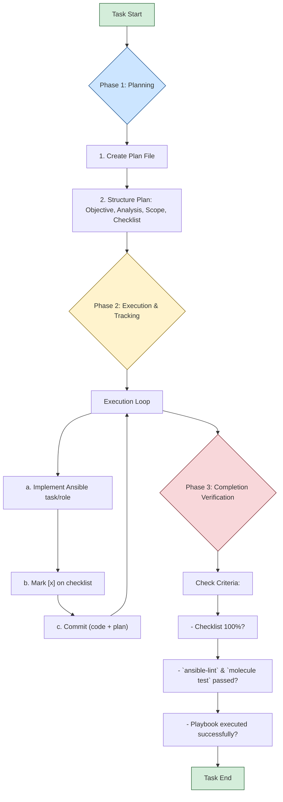

# Development and Contribution Guide: Ansible for Docker Swarm

## ✅ Funcionalidades de Teste Implementadas

### Sistema de Testes Integrado
- **Análise Estática**: ansible-lint 25.6.1 + yamllint para qualidade de código
- **Validação de Playbook**: Execução em modo check para validar sintaxe
- **Testes de Role**: Molecule com verificação de sintaxe e lint personalizado
- **Validação de Tarefas**: Verificação individual de cada role
- **Python 3.11**: Ambiente atualizado para suporte às versões mais recentes

### Funcionalidade de Lint Personalizada
**Implementação customizada para Molecule 6.x** (que removeu o comando `molecule lint`):
- Combina ansible-lint e yamllint
- Executado através do script `run_molecule_tests.sh`
- Disponível para todas as roles: common, docker_manager, docker_worker

```bash
# Executar lint para roles específicas
./run_molecule_tests.sh common lint
./run_molecule_tests.sh docker_manager lint  
./run_molecule_tests.sh docker_worker lint

# Ou usar o script completo que inclui lint
./run_simple_tests.sh
```

### Correções Implementadas
- ✅ Criadas tarefas para roles docker_manager e docker_worker
- ✅ Corrigidas convenções de nomenclatura de variáveis (prefixos obrigatórios)
- ✅ Implementada funcionalidade de lint customizada para Molecule 6.x
- ✅ Atualizada documentação com notas sobre limitações do Docker-in-Docker
- ✅ Atualizado ambiente para Python 3.11 e ansible-lint 25.6.1
- ✅ Corrigidos arquivos converge.yml do Molecule para compatibilidade com novas versões
- ✅ Atualizado pip para versão 25.1.1 para melhor compatibilidade

---

## 1. Project Overview

This document specifies the standards for automating a Docker Swarm cluster configuration using Ansible and defines the development protocol to be followed. The project must adhere to the principles of modularity, testability, security, and a structured development workflow.

**Note on `GEMINI.md`:** This file is a specific instruction set for AI assistants like Gemini, Claude, or other AI agents acting as software engineers. It should never be used as part of the project's user-facing documentation. New, specific documentation should be created for the project as needed, and this file should not be linked to or referenced in those documents.

## 2. Project Structure

The repository must follow this structure with comprehensive Molecule testing:

```
.
├── docs/
│   └── plans/
├── inventory/
│   ├── group_vars/
│   │   └── all.yml
│   └── hosts.ini
├── roles/
│   ├── common/
│   │   ├── defaults/
│   │   ├── handlers/
│   │   ├── molecule/
│   │   │   └── default/
│   │   │       ├── molecule.yml
│   │   │       ├── converge.yml
│   │   │       ├── prepare.yml
│   │   │       └── tests/
│   │   │           └── test_common.py
│   │   ├── tasks/
│   │   └── tests/
│   ├── docker_manager/
│   │   └── molecule/
│   │       └── default/
│   │           ├── molecule.yml
│   │           ├── converge.yml
│   │           ├── prepare.yml
│   │           └── tests/
│   │               └── test_docker_manager.py
│   └── docker_worker/
│       └── molecule/
│           └── default/
│               ├── molecule.yml
│               ├── converge.yml
│               ├── prepare.yml
│               └── tests/
│                   └── test_docker_worker.py
├── ssh_keys/
├── tests/
│   ├── requirements.txt
│   └── test_integration.py
├── compose.yml
├── Dockerfile
├── Dockerfile.test
├── run-playbook.sh
├── run_integration_tests.sh
├── run_molecule_tests.sh
└── playbook.yml
```

- **`docs/plans/`**: Contains the planning artifacts for each development task.
- **`inventory/`**: Host definitions and variables.
- **`roles/`**: Task definitions, separated by node responsibility, each with complete Molecule test suites.
- **`tests/`**: Infrastructure validation tests and test dependencies.
- **`Dockerfile`, `compose.yml`**: Defines the containerized development environment with Docker-in-Docker support.
- **`run-playbook.sh`**: Script for executing the playbooks.
- **`run_integration_tests.sh`**: Comprehensive integration test runner.
- **`run_molecule_tests.sh`**: Individual role test runner.
- **`playbook.yml`**: Main playbook that orchestrates all roles.

## 3. Development Environment

A containerized environment using Docker is mandatory for all development and execution to ensure consistency. The environment supports Docker-in-Docker for Molecule testing.

### 3.1. Dockerfile

The control node image is defined by a multi-stage Dockerfile that includes all necessary tools for execution and testing.

```dockerfile
# Multi-stage build for development and testing

# Base stage with common dependencies
FROM python:3.9-slim as base

# Install system dependencies including Docker CLI
RUN apt-get update && apt-get install -y --no-install-recommends \
    openssh-client \
    curl \
    apt-transport-https \
    ca-certificates \
    gnupg \
    lsb-release \
    && rm -rf /var/lib/apt/lists/*

# Install Docker CLI for Docker-in-Docker support
RUN curl -fsSL https://download.docker.com/linux/debian/gpg | gpg --dearmor -o /usr/share/keyrings/docker-archive-keyring.gpg \
    && echo "deb [arch=$(dpkg --print-architecture) signed-by=/usr/share/keyrings/docker-archive-keyring.gpg] https://download.docker.com/linux/debian $(lsb_release -cs) stable" | tee /etc/apt/sources.list.d/docker.list > /dev/null \
    && apt-get update \
    && apt-get install -y --no-install-recommends docker-ce-cli \
    && rm -rf /var/lib/apt/lists/*

# Install Python dependencies
RUN pip install --no-cache-dir \
    ansible \
    docker \
    "molecule[docker]" \
    testinfra \
    ansible-lint \
    yamllint \
    pytest \
    pytest-testinfra

# Development stage
FROM base as development
WORKDIR /ansible
COPY . /ansible
CMD ["ansible", "--version"]

# Testing stage with additional test dependencies
FROM base as testing
RUN pip install --no-cache-dir \
    pytest-xdist \
    pytest-cov \
    pytest-html
WORKDIR /ansible
COPY . /ansible
CMD ["molecule", "--version"]
```

### 3.2. Docker Compose

Use the following `compose.yml` to manage the control node container with Docker-in-Docker support.

```yaml
services:
  ansible-control:
    build: 
      context: .
      target: development
    container_name: ansible_control_node
    privileged: true  # Required for Docker-in-Docker and systemd
    volumes:
      - .:/ansible
      - ~/.ssh:/root/.ssh:ro
      - /var/run/docker.sock:/var/run/docker.sock
      - docker_data:/var/lib/docker
    environment:
      - DOCKER_TLS_CERTDIR=
      - DOCKER_HOST=unix:///var/run/docker.sock
    command: tail -f /dev/null

  ansible-test:
    build:
      context: .
      target: testing
    container_name: ansible_test_node
    privileged: true
    volumes:
      - .:/ansible
      - /var/run/docker.sock:/var/run/docker.sock
      - docker_test_data:/var/lib/docker
    environment:
      - DOCKER_TLS_CERTDIR=
      - DOCKER_HOST=unix:///var/run/docker.sock
    profiles:
      - testing
    command: tail -f /dev/null

volumes:
  docker_data:
  docker_test_data:
```

### 3.3. Environment Workflow Commands

- **Initialize Environment:**
  ```bash
  docker compose up --build -d
  ```

- **Access Container Shell:**
  ```bash
  docker compose exec ansible-control bash
  ```

- **Shutdown Environment:**
  ```bash
  docker compose down
  ```

## 4. Ansible Configuration

### 4.1. Inventory

The inventory must be modular. Host and group definitions are in `inventory/hosts.ini`.

**Authentication Requirement:** SSH key authentication is mandatory. The `ansible_ssh_private_key_file` variable must be used. For all other secrets, use **Ansible Vault**.

**`inventory/hosts.ini` Example:**
```ini
[managers]
manager1 ansible_host=192.168.1.10 ansible_ssh_private_key_file=~/.ssh/manager1_key

[workers]
worker1 ansible_host=192.168.1.20

[workers:vars]
ansible_ssh_private_key_file=~/.ssh/worker_nodes_key

[all:vars]
ansible_user=your_ssh_user
ansible_python_interpreter=/usr/bin/python3
```

### 4.2. Roles

Automation logic is encapsulated in roles, each with comprehensive Molecule test suites.

- **`common`**: Base configuration applied to all nodes (e.g., install Docker).
- **`docker_manager`**: Initializes the Swarm and manages the manager nodes.
- **`docker_worker`**: Joins the worker nodes to the Swarm.

#### 4.2.1. Role Testing Structure

Each role MUST include a complete Molecule test suite following this standardized structure:

```
roles/<role_name>/
├── defaults/           # Default variables
├── handlers/           # Handlers for service management
├── tasks/             # Main task definitions
├── molecule/          # Molecule test suite
│   └── default/
│       ├── molecule.yml      # Molecule configuration with Docker driver
│       ├── converge.yml      # Playbook to test the role
│       ├── prepare.yml       # System preparation tasks
│       └── tests/
│           └── test_<role>.py # Testinfra test cases
└── tests/             # Additional test files (optional)
```

#### 4.2.2. Molecule Configuration Standards

All Molecule configurations MUST:
- Use the Docker driver for containerized testing
- Use Ubuntu 22.04 as the base test image
- Enable privileged mode for systemd and Docker operations
- Include proper cgroupns_mode and volume mounts for systemd
- Configure Testinfra as the verifier with parallel execution
- Include comprehensive test sequences (lint, syntax, converge, idempotence, verify)

#### 4.2.3. Testinfra Test Standards

All Testinfra tests MUST:
- Test package installations and service states
- Verify configuration file contents and permissions
- Test network connectivity and port availability
- Validate Docker and Swarm functionality where applicable
- Include proper test function documentation
- Handle both positive and negative test cases

### 4.3. Main Playbook (`playbook.yml`)

The main playbook orchestrates the execution of roles.

```yaml
---
- name: Apply common configuration to all nodes
  hosts: all
  become: yes
  roles:
    - common

- name: Configure Docker Swarm Managers
  hosts: managers
  become: yes
  roles:
    - docker_manager

- name: Configure Docker Swarm Workers
  hosts: workers
  become: yes
  roles:
    - docker_worker
```

## 5. Execution and Testing

### 5.1. Execution Script (`run-playbook.sh`)

This script is the standard interface for running playbooks.

```bash
#!/bin/bash
set -e
TARGET=$1
EXTRA_ARGS=""
[ "$2" == "--check" ] && EXTRA_ARGS="--check"
CMD="ansible-playbook -i inventory/hosts.ini playbook.yml --vault-password-file .vault_pass $EXTRA_ARGS"

case "$TARGET" in
    all|managers|workers)
        docker compose exec ansible-control $CMD --limit "$TARGET"
        ;;
    *)
        echo "Usage: $0 {all|managers|workers} [--check]" >&2; exit 1
        ;;
esac
```

**Usage Examples:**
```bash
# Run on all hosts
./run-playbook.sh all

# Run in check mode (dry-run) on managers only
./run-playbook.sh managers --check
```

### 5.2. Testing Strategy

#### 5.2.1. Multi-Level Testing Approach

The project implements a comprehensive multi-level testing strategy:

1. **Static Analysis (Linting)**
   - `ansible-lint` for playbook and role quality
   - `yamllint` for YAML syntax validation
   - Executed automatically in CI/CD and Molecule tests

2. **Unit Testing (Molecule + Testinfra)**
   - Individual role testing in isolated containers
   - Docker driver for consistent, reproducible environments
   - Testinfra for infrastructure validation
   - Parallel test execution for efficiency

3. **Integration Testing**
   - Full playbook execution against test containers
   - End-to-end workflow validation
   - Multi-node Swarm functionality testing

4. **Idempotence Testing**
   - Automatic verification that roles can be run multiple times
   - Ensures configuration stability and reliability

#### 5.2.2. Molecule Test Execution

**Individual Role Testing:**
```bash
# Using the helper script (recommended)
./run_molecule_tests.sh <role_name> [test_command]

# Examples:
./run_molecule_tests.sh common test          # Full test suite
./run_molecule_tests.sh docker_manager lint  # Lint only
./run_molecule_tests.sh docker_worker verify # Verify only

# Manual execution within container:
docker compose exec ansible-control bash -c "cd roles/common && molecule test"
```

**Available Test Commands:**
- `test`: Run full test suite (default)
- `converge`: Run converge only
- `verify`: Run verify only
- `lint`: Run lint only
- `destroy`: Destroy test instances
- `list`: List test instances

#### 5.2.3. Integration Test Execution

**Comprehensive Integration Testing:**
```bash
./run_integration_tests.sh
```

This script executes:
1. Static analysis with `ansible-lint`
2. Dry-run validation with `--check` mode
3. Full playbook deployment
4. Infrastructure validation with Testinfra
5. Individual role Molecule tests
6. Cleanup and reporting

#### 5.2.4. Docker-in-Docker Testing Requirements

All testing relies on Docker-in-Docker capabilities:

- **Container Privileges**: Tests run in privileged containers
- **systemd Support**: Full systemd functionality in test containers
- **Docker Socket Access**: Direct access to Docker daemon
- **Network Isolation**: Each test gets isolated network environment
- **Resource Management**: Proper cleanup of test containers and networks

## 6. Development Protocol and Workflow

### 6.1. Git Workflow

#### Branching Strategy
All changes must be developed in a dedicated branch created from `main`.
- **Naming:** `<type>/<short-description>` (e.g., `feat/add-firewall-role`)

#### Conventional Commits
All commits MUST adhere to the [Conventional Commits v1.0.0](https://www.conventionalcommits.org/en/v1.0.0/) specification.
- **Structure:** `<type>(optional scope): <description>`

### 6.2. AI Operational Protocol

#### Core Principle: The Plan Precedes Action
No Ansible code implementation shall be initiated without a formally defined and registered execution plan in `/docs/plans/`.

#### Documentation Mandate
At the completion of any task, the AI must review all project documentation. If the changes introduced by the task are not accurately reflected in the documentation, the AI must create, update, or amend the documentation to ensure it is current and comprehensive. This includes, but is not limited to, the `README.md`, `docs/`, and any other relevant files.

#### General Process Flow


#### Phase 1: Planning
**Action**: Before writing code, generate the planning artifact.

1.  **Create Plan File**:
    - **Command**: Create a new Markdown file in `/docs/plans/`.
    - **Naming**: The name of each plan file must be only a number that must follow the sequence.
    - **Example**: `1.md`. If the file `1.md` already exists in `docs/plans`, then a new task must have the name `2.md`.

2.  **Structure the Plan**: The file must contain the sections: `1. Objective`, `2. Technical Analysis and Strategy`, `3. Scope of Modification`, and `4. Execution Plan (Checklist)`.

#### Phase 2: Execution and Tracking
**Action**: Implement the Ansible code following the plan and recording progress.

1.  **Continuous Update**: The plan file must be modified in real-time.
2.  **Progress Logging**: Immediately after completing a subtask, mark it as done: change `- [ ]` to `- [x]`.
3.  **Atomic Version Control**: Make a commit after completing significant subtasks, including the updated plan file.

#### Phase 3: Completion Criteria
**Action**: Verify the following conditions to validate task completion.

A task is declared **COMPLETE** if, and only if, all the following conditions return `TRUE`:

1.  **Checklist Complete**: The checklist in the plan is 100% filled with `[x]`.
2.  **Static Analysis Passed**: All code must pass `ansible-lint` and `yamllint` without errors.
3.  **Molecule Tests Passed**: All roles with Molecule configurations must pass `molecule test` successfully.
4.  **Integration Tests Passed**: The `./run_integration_tests.sh` script must execute without errors.
5.  **Playbook Validation**: The `./run-playbook.sh` script must execute in `--check` mode without errors.
6.  **Docker-in-Docker Functionality**: Verify that Molecule can create, manage, and destroy Docker containers.
7.  **Test Coverage**: Each role must have comprehensive Testinfra tests covering all functionality.
8.  **Plan as Proof**: The finalized plan file serves as the execution log and the auditable proof that all steps were followed.

#### Mandatory Testing Protocol for AI Agents

Before declaring any development task complete, AI agents MUST execute the following testing sequence:

```bash
# 1. Static Analysis
ansible-lint playbook.yml
yamllint .

# 2. Quick Development Testing (Recommended)
./run_simple_tests.sh

# 3. Individual Role Syntax and Lint Testing
./run_molecule_tests.sh common lint
./run_molecule_tests.sh common syntax
./run_molecule_tests.sh docker_manager lint
./run_molecule_tests.sh docker_manager syntax  
./run_molecule_tests.sh docker_worker lint
./run_molecule_tests.sh docker_worker syntax

# 4. Playbook Validation
ansible-playbook -i inventory/hosts.ini playbook.yml --check --limit all
```

**Testing Environment Requirements:**
- All tests MUST run within the containerized environment
- Basic functionality tests MUST pass for task completion
- Docker-in-Docker Molecule tests are optional but recommended when environment supports it
- All test artifacts MUST be cleaned up automatically

**Test Failure Protocol:**
- Any basic test failure MUST be resolved before task completion
- Root cause analysis MUST be documented in the plan
- Failed tests MUST be re-executed after fixes
- No task shall be marked complete with failing basic tests

**Docker-in-Docker Limitations:**
- Complex Docker-in-Docker scenarios may have connectivity issues in some environments
- Basic syntax testing and playbook validation are sufficient for development validation
- Full Molecule container testing is enhanced functionality when available
