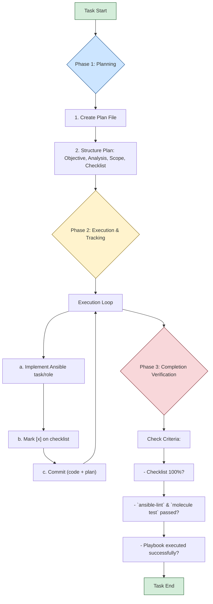

# Development and Contribution Guide: Ansible for Docker Swarm

## 1. Project Overview

This document specifies the standards for automating a Docker Swarm cluster configuration using Ansible and defines the development protocol to be followed. The project must adhere to the principles of modularity, testability, security, and a structured development workflow.

**Note on `GEMINI.md`:** This file is a specific instruction set for AI assistants like Gemini, Claude, or other AI agents acting as software engineers. It should never be used as part of the project's user-facing documentation. New, specific documentation should be created for the project as needed, and this file should not be linked to or referenced in those documents.

## 2. Project Structure

The repository must follow this structure:

```
.
├── docs/
│   └── plans/
├── inventory/
│   ├── group_vars/
│   │   └── all.yml
│   └── hosts.ini
├── roles/
│   ├── common/
│   ├── docker_manager/
│   └── docker_worker/
├── tests/
├── compose.yml
├── Dockerfile
├── run-playbook.sh
└── playbook.yml
```

- **`docs/plans/`**: Contains the planning artifacts for each development task.
- **`inventory/`**: Host definitions and variables.
- **`roles/`**: Task definitions, separated by node responsibility.
- **`tests/`**: Infrastructure validation tests.
- **`Dockerfile`, `compose.yml`**: Defines the containerized development environment.
- **`run-playbook.sh`**: Script for executing the playbooks.
- **`playbook.yml`**: Main playbook that orchestrates all roles.

## 3. Development Environment

A containerized environment using Docker is mandatory for all development and execution to ensure consistency.

### 3.1. Dockerfile

The control node image is defined by the following `Dockerfile`. It includes all necessary tools for execution and testing.

```dockerfile
FROM python:3.9-slim

# Install system dependencies
RUN apt-get update && apt-get install -y --no-install-recommends \
    openssh-client \
    && rm -rf /var/lib/apt/lists/*

# Install Python dependencies
RUN pip install ansible docker "molecule[docker]" testinfra ansible-lint

# Configure the working directory
WORKDIR /ansible
COPY . /ansible

# Default command
CMD ["ansible", "--version"]
```

### 3.2. Docker Compose

Use the following `compose.yml` to manage the control node container.

```yaml
services:
  ansible-control:
    build: .
    container_name: ansible_control_node
    volumes:
      - .:/ansible
      # Mount SSH keys for host access
      - ~/.ssh:/root/.ssh:ro
      # Mount the Docker socket for Molecule
      - /var/run/docker.sock:/var/run/docker.sock
    command: tail -f /dev/null # Keep the container running
```

### 3.3. Environment Workflow Commands

- **Initialize Environment:**
  ```bash
  docker compose up --build -d
  ```

- **Access Container Shell:**
  ```bash
  docker compose exec ansible-control bash
  ```

- **Shutdown Environment:**
  ```bash
  docker compose down
  ```

## 4. Ansible Configuration

### 4.1. Inventory

The inventory must be modular. Host and group definitions are in `inventory/hosts.ini`.

**Authentication Requirement:** SSH key authentication is mandatory. The `ansible_ssh_private_key_file` variable must be used. For all other secrets, use **Ansible Vault**.

**`inventory/hosts.ini` Example:**
```ini
[managers]
manager1 ansible_host=192.168.1.10 ansible_ssh_private_key_file=~/.ssh/manager1_key

[workers]
worker1 ansible_host=192.168.1.20

[workers:vars]
ansible_ssh_private_key_file=~/.ssh/worker_nodes_key

[all:vars]
ansible_user=your_ssh_user
ansible_python_interpreter=/usr/bin/python3
```

### 4.2. Roles

Automation logic is encapsulated in roles.

- **`common`**: Base configuration applied to all nodes (e.g., install Docker).
- **`docker_manager`**: Initializes the Swarm and manages the manager nodes.
- **`docker_worker`**: Joins the worker nodes to the Swarm.

### 4.3. Main Playbook (`playbook.yml`)

The main playbook orchestrates the execution of roles.

```yaml
---
- name: Apply common configuration to all nodes
  hosts: all
  become: yes
  roles:
    - common

- name: Configure Docker Swarm Managers
  hosts: managers
  become: yes
  roles:
    - docker_manager

- name: Configure Docker Swarm Workers
  hosts: workers
  become: yes
  roles:
    - docker_worker
```

## 5. Execution and Testing

### 5.1. Execution Script (`run-playbook.sh`)

This script is the standard interface for running playbooks.

```bash
#!/bin/bash
set -e
TARGET=$1
EXTRA_ARGS=""
[ "$2" == "--check" ] && EXTRA_ARGS="--check"
CMD="ansible-playbook -i inventory/hosts.ini playbook.yml --vault-password-file .vault_pass $EXTRA_ARGS"

case "$TARGET" in
    all|managers|workers)
        docker compose exec ansible-control $CMD --limit "$TARGET"
        ;;
    *)
        echo "Usage: $0 {all|managers|workers} [--check]" >&2; exit 1
        ;;
esac
```

**Usage Examples:**
```bash
# Run on all hosts
./run-playbook.sh all

# Run in check mode (dry-run) on managers only
./run-playbook.sh managers --check
```

### 5.2. Testing Strategy

#### Static Analysis (Linting)
All code must pass `ansible-lint` without errors.
```bash
docker compose exec ansible-control ansible-lint playbook.yml
```

#### Infrastructure Testing (Molecule)
All roles must have a corresponding Molecule test suite using `Testinfra` as the verifier.
```bash
docker compose exec ansible-control bash -c "cd roles/common && molecule test"
```

## 6. Development Protocol and Workflow

### 6.1. Git Workflow

#### Branching Strategy
All changes must be developed in a dedicated branch created from `main`.
- **Naming:** `<type>/<short-description>` (e.g., `feat/add-firewall-role`)

#### Conventional Commits
All commits MUST adhere to the [Conventional Commits v1.0.0](https://www.conventionalcommits.org/en/v1.0.0/) specification.
- **Structure:** `<type>(optional scope): <description>`

### 6.2. AI Operational Protocol

#### Core Principle: The Plan Precedes Action
No Ansible code implementation shall be initiated without a formally defined and registered execution plan in `/docs/plans/`.

#### Documentation Mandate
At the completion of any task, the AI must review all project documentation. If the changes introduced by the task are not accurately reflected in the documentation, the AI must create, update, or amend the documentation to ensure it is current and comprehensive. This includes, but is not limited to, the `README.md`, `docs/`, and any other relevant files.

#### General Process Flow


#### Phase 1: Planning
**Action**: Before writing code, generate the planning artifact.

1.  **Create Plan File**:
    - **Command**: Create a new Markdown file in `/docs/plans/`.
    - **Naming**: `[task-id].md`.
    - **Example**: `/docs/plans/FEAT-101.md`.

2.  **Structure the Plan**: The file must contain the sections: `1. Objective`, `2. Technical Analysis and Strategy`, `3. Scope of Modification`, and `4. Execution Plan (Checklist)`.

#### Phase 2: Execution and Tracking
**Action**: Implement the Ansible code following the plan and recording progress.

1.  **Continuous Update**: The plan file must be modified in real-time.
2.  **Progress Logging**: Immediately after completing a subtask, mark it as done: change `- [ ]` to `- [x]`.
3.  **Atomic Version Control**: Make a commit after completing significant subtasks, including the updated plan file.

#### Phase 3: Completion Criteria
**Action**: Verify the following conditions to validate task completion.

A task is declared **COMPLETE** if, and only if, all the following conditions return `TRUE`:

1.  **Checklist Complete**: The checklist in the plan is 100% filled with `[x]`.
2.  **Tests Passed**: The `ansible-lint` and `molecule test` commands are executed and finish successfully.
3.  **Successful Playbook Execution**: The `./run-playbook.sh` script is executed in `--check` mode without errors.
4.  **Plan as Proof**: The finalized plan file serves as the execution log and the auditable proof that all steps were followed.
