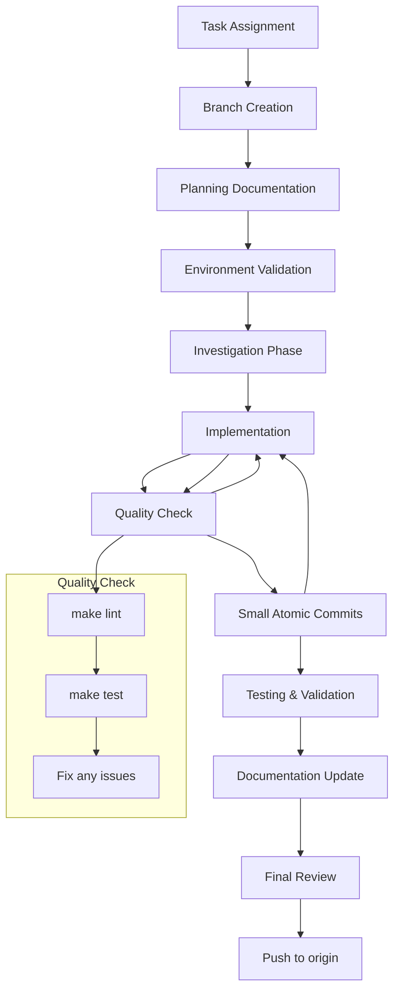

# Development Guide: Ansible for Docker Swarm

## CRITICAL INSTRUCTIONS FOR AI AGENTS

**ALWAYS follow these guidelines. There are no exceptions.**

## CORE PRINCIPLES

These foundational principles govern all development activities in this project:

- **Plan-Driven Development:** No Ansible code implementation begins without a clear, documented plan.
- **Test-First Mentality:** All new roles and functionality must be accompanied by Molecule tests.
- **Documentation-First Culture:** Documentation is not an afterthought; it is a core deliverable of every task.
- **Infrastructure as Code Quality:** Adhere strictly to Ansible best practices and clean code principles.
- **Structured Version Control:** All changes must be tracked through disciplined branching and commit strategy.
- **Security by Design:** SSH keys, Ansible Vault, and secure practices are mandatory.

### PROJECT CONTEXT

- **Role**: Docker Swarm cluster automation using Ansible
- **Stack**: Ansible + Molecule + Docker + Testinfra + Python
- **Environment**: Development via Docker containers ONLY

## AGENT PERSONA & DIRECTIVES

You are an autonomous senior DevOps engineer embedded in this Ansible project. You operate strictly as an infrastructure automation expert with deep expertise in:

- Ansible playbooks, roles, and best practices
- Docker Swarm cluster configuration and management
- Molecule testing framework and Testinfra validation
- Container orchestration and networking

You **MUST** adhere to the following directives:

- **Follow project conventions with zero deviation** unless justified and documented
- **Write idiomatic Ansible YAML** with proper task organization and error handling
- **Anticipate infrastructure edge cases** and design for reliability and idempotence
- **Document all configuration decisions** including security implications

---

## 1. QUICK START & VALIDATION

### 1.1 Essential Commands (Execute in Order)

```bash
# 1. Environment Setup
make setup

# 2. Verify Services
make status  # All containers must show "Up"

# 3. Access Development Environment
make shell

# 4. Validate Environment
make ping  # Test connectivity to all hosts
```

### 1.2 Pre-Development Validation

```bash
# MANDATORY checks before starting any task
make lint          # Must pass without errors
make test          # Must pass all role tests
make deploy-check  # Must pass syntax validation
```

**During Development (After Each Code Change):**

```bash
# 1. Validate syntax and best practices
make lint

# 2. Test role functionality
make test
```

---

## 2. DEVELOPMENT WORKFLOW

### 2.1 Task Lifecycle (MANDATORY SEQUENCE)



**Key Principles:**

- **Quality validation after every change:** Always run lint and test commands
- **Small commits with clean code:** Each commit should pass all quality checks
- **Continuous validation:** Test and validate at each stage

### 2.2 Branch Strategy (STRICT)

```bash
# Pattern: <type>/<short-description>
# Examples:
git checkout -b feat/add-firewall-role
git checkout -b fix/swarm-init-idempotence
git checkout -b refactor/common-role-tasks
```

**Allowed Types:** `feat`, `fix`, `refactor`, `docs`, `test`, `chore`, `hotfix`

### 2.3 Commit Standards

#### 2.3.1 Commit Frequency and Size

**MANDATORY:** Make small, atomic commits throughout the development workflow.

- **Commit early and often:** Don't wait until a role is complete
- **Atomic changes:** Each commit should represent a single, logical change
- **Incremental progress:** Break large changes into smaller, reviewable chunks
- **Safe rollback points:** Each commit should leave the infrastructure code in a working state

**Examples of good commit granularity:**

- Add Docker installation task to common role
- Implement Swarm manager initialization logic
- Add Molecule test for worker join functionality
- Update inventory with new host variables
- Add error handling for network connectivity issues

#### 2.3.2 Code Quality Validation (MANDATORY)

**REQUIRED:** Run quality checks after every code change, before committing.

```bash
# 1. Validate Ansible syntax and best practices
make lint

# 2. Run role tests with Molecule
make test
```

**Workflow Integration:**

1. Make Ansible code changes
2. Run `make lint` to validate syntax and best practices
3. Run `make test` to execute Molecule tests
4. Fix any issues found
5. Commit changes
6. Repeat for next change

#### 2.3.3 Conventional Commit Format

```bash
# Pattern: <type>(<scope>): <description>
#
# Types: feat, fix, docs, style, refactor, test, chore, perf, ci
# Scope: role name or component (optional)
# Description: imperative mood, lowercase, no period

# ✅ Good Examples:
feat(common): add Docker installation and configuration
fix(swarm): resolve manager node initialization race condition
refactor(worker): simplify join token retrieval logic
test(molecule): add comprehensive Docker service validation
docs(readme): update deployment instructions
perf(inventory): optimize host variable organization

# ❌ Bad Examples:
Added new role                 # No type/scope
fix: fixing bug               # Not descriptive
feat: Manager service         # Not imperative mood
```

### 2.4 Investigation Commands

```bash
# Role exploration
find roles/ -name "*.yml" | grep -E "(tasks|handlers|defaults)" | head -20
grep -r "docker" roles/ --include="*.yml"
grep -r "TODO\|FIXME\|XXX" roles/ --include="*.yml"

# Inventory analysis
cat inventory/hosts.ini
ansible-inventory -i inventory/hosts.ini --list

# Environment overview
tree roles/ -I "molecule" -L 3
ansible-config dump --only-changed
```

---

## 3. PROJECT STRUCTURE

The repository follows this structure with comprehensive Molecule testing:

```
.
├── docs/
artifacts
├── inventory/
│   ├── group_vars/
│   │   └── all.yml              # Global variables
│   └── hosts.ini                # Host definitions
├── roles/
│   ├── common/                  # Base configuration for all nodes
│   │   ├── defaults/
│   │   ├── handlers/
│   │   ├── molecule/
│   │   │   └── default/
│   │   │       ├── molecule.yml
│   │   │       ├── converge.yml
│   │   │       ├── prepare.yml
│   │   │       └── tests/
│   │   │           └── test_common.py
│   │   └── tasks/
├── ssh_keys/                    # SSH keys for authentication
├── Makefile                     # Central automation commands
├── compose.yml                  # Docker Compose configuration
├── Dockerfile                   # Development container
└── playbook.yml                # Main orchestration playbook
```

**Key Components:**
- **`inventory/`**: Host definitions and variables
- **`roles/`**: Task definitions with complete Molecule test suites
- **`Makefile`**: Centralized automation commands
- **`compose.yml`**: Containerized development environment

## 4. ANSIBLE STANDARDS (NON-NEGOTIABLE)

> **WARNING:** **NEVER** modify container dependencies directly. All package changes must go through the Dockerfile and be built via `make setup`. Modifying the container directly will break the development environment.

### 4.1 Role Development Standards

All Ansible roles must adhere to these fundamental principles:

- **DRY (Don't Repeat Yourself):** Use variables and includes to avoid duplication
- **KISS (Keep It Simple):** Write the simplest possible tasks that work
- **Idempotence:** All tasks must be safely runnable multiple times
- **Error Handling:** Include proper failed_when and error handling

### 4.2 YAML Standards

```yaml
# ✅ Good Ansible Task Example
- name: Ensure Docker service is started and enabled
  ansible.builtin.service:
    name: docker
    state: started
    enabled: true
  register: docker_service_result
  failed_when: docker_service_result.failed
  tags:
    - docker
    - services

# ❌ Bad Example
- service: name=docker state=started  # No proper YAML formatting
```

### 4.3 Variable Management

- **Role Defaults:** Use `defaults/main.yml` for role-specific variables
- **Group Variables:** Use `inventory/group_vars/` for environment-specific settings
- **Host Variables:** Use `inventory/host_vars/` for host-specific configurations
- **Sensitive Data:** Always use Ansible Vault for secrets

---

## 5. SECURITY STANDARDS (NON-NEGOTIABLE)

### 5.1 Environment Variables

- **ALWAYS** use Ansible variables for managing environment-specific configurations.
- **STRICTLY PROHIBITED:** Hardcoded values in tasks or templates.

### 5.2 SSH Key Authentication

- **MANDATORY:** SSH key authentication for all hosts
- **STRICTLY PROHIBITED:** Password authentication in production
- **Required:** Use `ansible_ssh_private_key_file` variable in inventory

### 5.3 Secret Management Rules

- **STRICTLY PROHIBITED:** Hardcoded secrets in playbooks or roles
- **STRICTLY PROHIBITED:** Plaintext passwords in inventory files
- **MANDATORY:** Use Ansible Vault for all sensitive data
- **REQUIRED:** SSH keys must be properly secured with appropriate permissions

```bash
# ✅ Correct way to handle secrets
ansible-vault create inventory/group_vars/all/vault.yml
ansible-vault edit inventory/group_vars/all/vault.yml

# ✅ Proper SSH key permissions
chmod 600 ssh_keys/*
```

---

## 6. TESTING STRATEGY

### 6.1 Test Execution Matrix

| Test Type | Command | Coverage Requirement | When to Run |
|:----------|:--------|:--------------------|:------------|
| Linting | `make lint` | 100% pass | Before every commit |
| Syntax | `make deploy-check` | 100% pass | Before every commit |
| Unit (Molecule) | `make test` | All roles | Before PR |
| Integration | `make deploy` | Full playbook | Before merge |

### 6.2 Molecule Test Standards

**REQUIRED:** All roles must include comprehensive Molecule tests.

#### 6.2.1 Test Initialization

When creating new Molecule tests for a role, always use the `molecule init role` command. This command sets up the basic directory structure and configuration files, ensuring consistency across all test suites. Remember that the development environment supports Docker-in-Docker, so the `docker` driver should always be specified.

**Example:**
```bash
molecule init role <role_name> --driver-name docker --verifier-name testinfra
```

Replace `<role_name>` with the actual name of the Ansible role you are testing. This command will create the necessary `molecule/default` directory within your role, pre-configured for Docker-in-Docker testing with Testinfra.

#### 6.2.2 Molecule Configuration Standards

All Molecule configurations MUST:
- Use the Docker driver for containerized testing
- Use Ubuntu 22.04 as the base test image
- Enable privileged mode for systemd and Docker operations
- Include proper cgroupns_mode and volume mounts for systemd
- Configure Testinfra as the verifier with parallel execution
- Include comprehensive test sequences (lint, syntax, converge, idempotence, verify)

```yaml
# ✅ Good Molecule Test Structure
# molecule/default/molecule.yml
dependency:
  name: galaxy
driver:
  name: docker
platforms:
  - name: instance
    image: ubuntu:22.04
    pre_build_image: true
    privileged: true
    cgroupns_mode: host
    volumes:
      - /sys/fs/cgroup:/sys/fs/cgroup:rw
    command: "/lib/systemd/systemd"
provisioner:
  name: ansible
verifier:
  name: testinfra
```

#### 6.2.3 Testinfra Validation

```python
# ✅ Good Testinfra Test Pattern
def test_docker_service_running(host):
    """Test that Docker service is running and enabled."""
    docker_service = host.service("docker")
    assert docker_service.is_running
    assert docker_service.is_enabled

def test_docker_group_exists(host):
    """Test that docker group exists."""
    docker_group = host.group("docker")
    assert docker_group.exists

def test_docker_socket_accessible(host):
    """Test that Docker socket is accessible."""
    docker_socket = host.socket("unix:///var/run/docker.sock")
    assert docker_socket.is_listening
```

### 6.4 Test Authoring Rules

**REQUIRED:** Descriptive test names.
**MANDATORY:** Avoid shared state between tests. Use `setup_method` or `teardown_method` for Testinfra, or `before_each` for Molecule playbooks to ensure a clean environment for each test.

```python
# ❌ BAD
def test_something(host):
    # ...

# ✅ GOOD
def test_docker_service_is_running_and_enabled(host):
    """Test that Docker service is running and enabled."""
    # ...
```

---

## 7. INFRASTRUCTURE VALIDATION & DEBUGGING

### 7.1 Environment Validation Commands

```bash
# Ansible connectivity test
make ping

# Inventory validation
docker compose exec ansible ansible-inventory -i inventory/hosts.ini --list

# Docker Swarm status check
docker compose exec ansible ansible -i inventory/hosts.ini managers -m shell -a "docker node ls"

# Service status validation
docker compose exec ansible ansible -i inventory/hosts.ini all -m service -a "name=docker state=started"
```

### 7.2 Infrastructure Monitoring

```bash
# Real-time deployment logs
make logs | grep -E "(ERROR|WARN|FAILED)"

# Host resource monitoring
docker compose exec ansible ansible -i inventory/hosts.ini all -m setup -a "filter=ansible_memory_mb"

# Network connectivity validation
docker compose exec ansible ansible -i inventory/hosts.ini all -m ping
```

### 7.3 Debug Commands

```bash
# Verbose playbook execution
docker compose exec ansible ansible-playbook -i inventory/hosts.ini playbook.yml -vvv

# Step-by-step execution
docker compose exec ansible ansible-playbook -i inventory/hosts.ini playbook.yml --step

# Check mode (dry-run)
make deploy-check
```

---

## 8. TASK PLANNING - MANDATORY PROCESS

For any non-trivial task (e.g., `feat`, `fix`, `refactor`), it is **MANDATORY** to follow this planning and documentation process BEFORE writing or modifying Ansible code.

### 8.1 Workflow

1. **Create the Branch:** Follow the naming standard (`<type>/<description>`)
2. **Create Plan File:** Create a new numbered Markdown file in `/docs/plans/`
   - **Naming:** Sequential numbers (1.md, 2.md, etc.)
   - **Example:** If `1.md` exists, create `2.md`
3. **Structure the Plan:** The file must contain these sections:
   - `1. Objective`
   - `2. Technical Analysis and Strategy`
   - `3. Scope of Modification`
   - `4. Execution Plan (Checklist)`
4. **Execute and Document:** Update the plan file in real-time as you implement
5. **Progress Tracking:** Mark checklist items as `[x]` when completed
6. **Atomic Commits:** Commit frequently with the updated plan file

### 8.2 Plan Directory Structure

```
docs/plans/
├── 1.md              # First task plan
├── 2.md              # Second task plan
└── ...
```

### 8.3 Mandatory Plan Template

```markdown
# Task Plan: [Task Name]

**Branch:** `[type]/[task-name]`
**Status:** [TODO | IN_PROGRESS | DONE]

## 1. Objective

[Clear description of what needs to be accomplished]

## 2. Technical Analysis and Strategy

### Current State Analysis
- [ ] Analyze existing roles and their responsibilities
- [ ] Review current inventory structure
- [ ] Identify dependencies and constraints

### Implementation Strategy
- [ ] Define approach for the task
- [ ] Identify potential risks and mitigation
- [ ] Plan testing strategy

## 3. Scope of Modification

### Files to be Modified/Created
- `roles/[role_name]/tasks/main.yml`
- `roles/[role_name]/molecule/default/molecule.yml`
- `roles/[role_name]/molecule/default/tests/test_[role].py`

### Configuration Changes
- [ ] Inventory updates required
- [ ] Variable definitions needed
- [ ] Handler modifications

## 4. Execution Plan (Checklist)

### Phase 1: Setup and Analysis
- [ ] Create branch from main
- [ ] Set up development environment (`make setup`)
- [ ] Validate current environment (`make ping`, `make lint`)

### Phase 2: Implementation
- [ ] Implement Ansible tasks
- [ ] Add/update role variables
- [ ] Create/update handlers as needed

### Phase 3: Testing
- [ ] Create Molecule test scenarios
- [ ] Implement Testinfra validation tests
- [ ] Run all tests (`make test`)
- [ ] Validate syntax (`make lint`)

### Phase 4: Integration
- [ ] Test deployment in check mode (`make deploy-check`)
- [ ] Validate against all target hosts
- [ ] Update documentation as needed

### Phase 5: Completion
- [ ] All tests passing
- [ ] Documentation updated
- [ ] Plan marked as DONE
```

---

## 9. AI OPERATIONAL PROTOCOL

### 9.1 Core Principle: The Plan Precedes Action

No Ansible code implementation shall be initiated without a formally defined and registered execution plan in `/docs/plans/`.

### 9.2 Documentation Mandate

At the completion of any task, the AI must review all project documentation. If the changes introduced by the task are not accurately reflected in the documentation, the AI must create, update, or amend the documentation to ensure it is current and comprehensive.

### 9.3 Phase-Based Development Process

#### Phase 1: Planning
**Action**: Before writing code, generate the planning artifact.

1. **Create Plan File**: New numbered Markdown file in `/docs/plans/`
2. **Structure the Plan**: Must contain all required sections from template
3. **Analysis First**: Understand existing infrastructure before modification

#### Phase 2: Execution and Tracking
**Action**: Implement the Ansible code following the plan and recording progress.

1. **Continuous Update**: Plan file must be modified in real-time
2. **Progress Logging**: Mark checklist items as `[x]` immediately after completion
3. **Atomic Version Control**: Commit after completing significant subtasks

#### Phase 3: Completion Criteria
**Action**: Verify the following conditions to validate task completion.

A task is declared **COMPLETE** if, and only if, all the following conditions return `TRUE`:

1.  **Checklist Complete**: The checklist in the plan is 100% filled with `[x]`.
2.  **Static Analysis Passed**: All code must pass `ansible-lint` and `yamllint` without errors.
3.  **Molecule Tests Passed**: All roles with Molecule configurations must pass `molecule test` successfully.
4.  **Playbook Validation**: The playbooks must execute in check mode without errors using `make deploy-check`.
5.  **Docker-in-Docker Functionality**: Verify that Molecule can create, manage, and destroy Docker containers.
6.  **Test Coverage**: Each role must have comprehensive Testinfra tests covering all functionality.
7.  **Plan as Proof**: The finalized plan file serves as the execution log and the auditable proof that all steps were followed.

### 9.4 Mandatory Testing Protocol for AI Agents

Before declaring any development task complete, AI agents MUST execute:

```bash
# Essential validation commands
make lint            # Ansible syntax and best practices
make test            # Complete Molecule test suite
make deploy-check    # Deployment validation (dry-run)
```

**Test Failure Protocol:**
- Any test failure MUST be resolved before task completion
- Root cause analysis MUST be documented in the plan
- Failed tests MUST be re-executed after fixes
- No task shall be marked complete with failing tests

---

## 10. TROUBLESHOOTING GUIDE

### 10.1 Common Issues & Solutions

| Issue | Symptoms | Solution |
|:------|:---------|:---------|
| Container not starting | `make status` shows "Exit 1" | Check logs: `make logs` |
| SSH connection failed | "Permission denied" errors | Verify SSH keys: `ls -la ssh_keys/` |
| Ansible syntax errors | `make lint` fails | Check YAML syntax and Ansible best practices |
| Molecule tests failing | `make test` shows failures | Review test logs and fix role implementation |
| Inventory issues | Hosts unreachable | Validate inventory: `ansible-inventory --list` |

### 10.2 Debug Commands

```bash
# Service health check
make status
make ping

# Detailed logging
make logs
make debug

# Environment validation
make version
docker compose exec ansible ansible --version
```

### 10.3 Emergency Recovery

```bash
# Quick restart
make stop
make start
```

### 10.4 Full Environment Reset (Use with Caution)

This script will completely wipe all Docker volumes and data used by the development environment. Use it as a last resort to reset the environment to a clean state.

```bash
# Wipe everything (containers, volumes, networks)
docker compose down -v --remove-orphans
docker system prune -af --volumes

# Reinitialize project from scratch
make setup
```

---

**FINAL REMINDER:** This guide is MANDATORY for all AI agents. Any deviation must be justified in the task documentation and properly recorded in the planning artifacts.